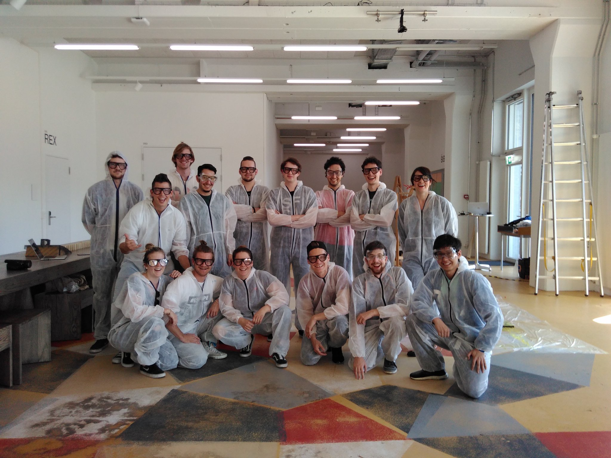

# physicalcomputing
A repository for the studio prototyping course, it includes resources, sensor manuals, arduino codes and documentation of the final assignment - a rube goldberg machine made of structural and electronical components.

# links:
presentation 2017 video: https://www.facebook.com/hslu.ch/videos/1637362729611935/
course info and material: https://docs.google.com/document/d/1U9Cv6gGpSYofoBj8cSDvJFm2s000Iq7i7ITtQwkIzkc/edit?usp=sharing
